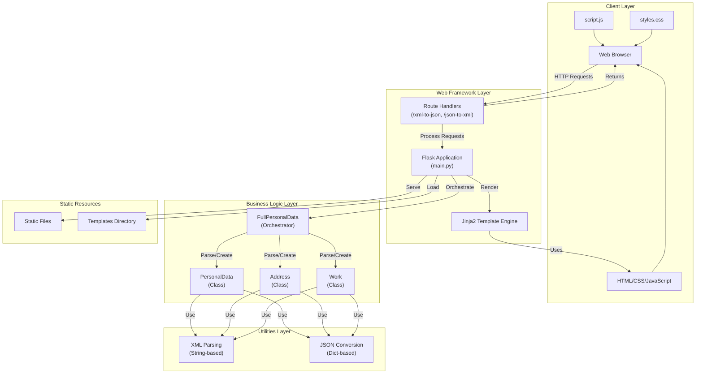
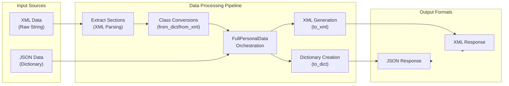
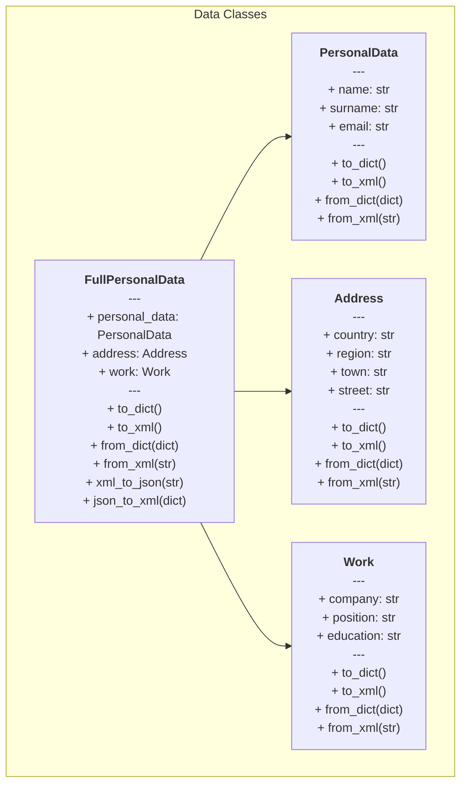

# Component Diagram - XML to JSON Server Architecture

## System Components and Their Relationships

```mermaid
graph TB
    subgraph Client["Client Layer"]
        Browser["Web Browser"]
        HTML["HTML/CSS/JavaScript"]
        Script["script.js"]
        Styles["styles.css"]
    end

    subgraph Web["Web Framework Layer"]
        Flask["Flask Application<br/>(main.py)"]
        Routes["Route Handlers<br/>(/xml-to-json, /json-to-xml)"]
        TemplateEngine["Jinja2 Template Engine"]
    end

    subgraph Business["Business Logic Layer"]
        FPD["FullPersonalData<br/>(Orchestrator)"]
        PD["PersonalData<br/>(Class)"]
        Addr["Address<br/>(Class)"]
        Work["Work<br/>(Class)"]
    end

    subgraph Utils["Utilities Layer"]
        XMLParser["XML Parsing<br/>(String-based)"]
        JSONConv["JSON Conversion<br/>(Dict-based)"]
    end

    subgraph Static["Static Resources"]
        StaticFiles["Static Files"]
        Templates["Templates Directory"]
    end

    Browser -->|HTTP Requests| Routes
    HTML --> Browser
    Script --> Browser
    Styles --> Browser
    
    Routes -->|Process Requests| Flask
    Flask -->|Render| TemplateEngine
    TemplateEngine -->|Uses| HTML
    
    Flask -->|Orchestrate| FPD
    
    FPD -->|Parse/Create| PD
    FPD -->|Parse/Create| Addr
    FPD -->|Parse/Create| Work
    
    PD -->|Use| XMLParser
    PD -->|Use| JSONConv
    Addr -->|Use| XMLParser
    Addr -->|Use| JSONConv
    Work -->|Use| XMLParser
    Work -->|Use| JSONConv
    
    Flask -->|Serve| StaticFiles
    Flask -->|Load| Templates
    
    Routes -->|Returns| Browser
```

## Detailed Component Interactions

```mermaid
graph LR
    subgraph Input["Input Sources"]
        XMLData["XML Data<br/>(Raw String)"]
        JSONData["JSON Data<br/>(Dictionary)"]
    end

    subgraph Processing["Data Processing Pipeline"]
        FPD_Orchestrate["FullPersonalData<br/>Orchestration"]
        Extract["Extract Sections<br/>(XML Parsing)"]
        ClassConvert["Class Conversions<br/>(from_dict/from_xml)"]
        DictConvert["Dictionary Creation<br/>(to_dict)"]
        XMLConvert["XML Generation<br/>(to_xml)"]
    end

    subgraph Output["Output Formats"]
        JSONOutput["JSON Response"]
        XMLOutput["XML Response"]
    end

    XMLData --> Extract
    Extract --> ClassConvert
    ClassConvert --> FPD_Orchestrate
    FPD_Orchestrate --> DictConvert
    DictConvert --> JSONOutput

    JSONData --> FPD_Orchestrate
    FPD_Orchestrate --> XMLConvert
    XMLConvert --> XMLOutput

    JSONOutput --> Output
    XMLOutput --> Output
```

## Class Component Structure

```mermaid
graph TB
    subgraph Classes["Data Classes"]
        PersonalData["<b>PersonalData</b><br/>---<br/>+ name: str<br/>+ surname: str<br/>+ email: str<br/>---<br/>+ to_dict()<br/>+ to_xml()<br/>+ from_dict(dict)<br/>+ from_xml(str)"]
        
        Address["<b>Address</b><br/>---<br/>+ country: str<br/>+ region: str<br/>+ town: str<br/>+ street: str<br/>---<br/>+ to_dict()<br/>+ to_xml()<br/>+ from_dict(dict)<br/>+ from_xml(str)"]
        
        Work["<b>Work</b><br/>---<br/>+ company: str<br/>+ position: str<br/>+ education: str<br/>---<br/>+ to_dict()<br/>+ to_xml()<br/>+ from_dict(dict)<br/>+ from_xml(str)"]
        
        FullPersonalData["<b>FullPersonalData</b><br/>---<br/>+ personal_data: PersonalData<br/>+ address: Address<br/>+ work: Work<br/>---<br/>+ to_dict()<br/>+ to_xml()<br/>+ from_dict(dict)<br/>+ from_xml(str)<br/>+ xml_to_json(str)<br/>+ json_to_xml(dict)"]
    end

    FullPersonalData --> PersonalData
    FullPersonalData --> Address
    FullPersonalData --> Work
```
