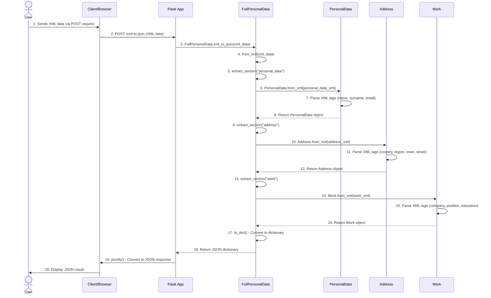
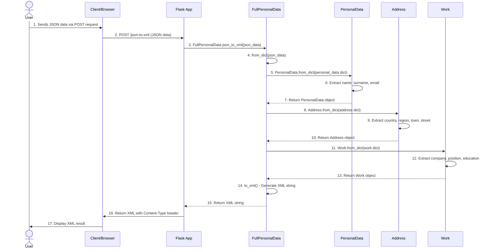

# Sequence Diagram - XML to JSON Server

## XML to JSON Conversion Flow

```mermaid
sequenceDiagram
    actor User
    participant Client as Client/Browser
    participant Flask as Flask App
    participant FPD as FullPersonalData
    participant PD as PersonalData
    participant Addr as Address
    participant Work as Work

    User->>Client: 1. Sends XML data via POST request
    Client->>Flask: 2. POST /xml-to-json (XML data)
    Flask->>FPD: 3. FullPersonalData.xml_to_json(xml_data)
    FPD->>FPD: 4. from_xml(xml_data)
    FPD->>FPD: 5. extract_section("personal_data")
    FPD->>PD: 6. PersonalData.from_xml(personal_data_xml)
    PD->>PD: 7. Parse XML tags (name, surname, email)
    PD-->>FPD: 8. Return PersonalData object
    FPD->>FPD: 9. extract_section("address")
    FPD->>Addr: 10. Address.from_xml(address_xml)
    Addr->>Addr: 11. Parse XML tags (country, region, town, street)
    Addr-->>FPD: 12. Return Address object
    FPD->>FPD: 13. extract_section("work")
    FPD->>Work: 14. Work.from_xml(work_xml)
    Work->>Work: 15. Parse XML tags (company, position, education)
    Work-->>FPD: 16. Return Work object
    FPD->>FPD: 17. to_dict() - Convert to dictionary
    FPD-->>Flask: 18. Return JSON dictionary
    Flask->>Client: 19. jsonify() - Convert to JSON response
    Client->>User: 20. Display JSON result
```

## JSON to XML Conversion Flow

```mermaid
sequenceDiagram
    actor User
    participant Client as Client/Browser
    participant Flask as Flask App
    participant FPD as FullPersonalData
    participant PD as PersonalData
    participant Addr as Address
    participant Work as Work

    User->>Client: 1. Sends JSON data via POST request
    Client->>Flask: 2. POST /json-to-xml (JSON data)
    Flask->>FPD: 3. FullPersonalData.json_to_xml(json_data)
    FPD->>FPD: 4. from_dict(json_data)
    FPD->>PD: 5. PersonalData.from_dict(personal_data dict)
    PD->>PD: 6. Extract name, surname, email
    PD-->>FPD: 7. Return PersonalData object
    FPD->>Addr: 8. Address.from_dict(address dict)
    Addr->>Addr: 9. Extract country, region, town, street
    Addr-->>FPD: 10. Return Address object
    FPD->>Work: 11. Work.from_dict(work dict)
    Work->>Work: 12. Extract company, position, education
    Work-->>FPD: 13. Return Work object
    FPD->>FPD: 14. to_xml() - Generate XML string
    FPD-->>Flask: 15. Return XML string
    Flask->>Client: 16. Return XML with Content-Type header
    Client->>User: 17. Display XML result
```
