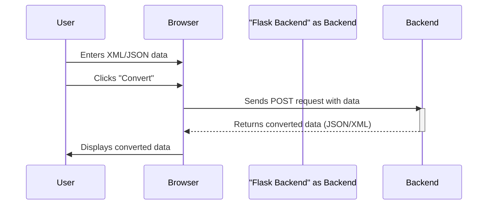

```mermaid
sequenceDiagram
    participant User
    participant Browser
    participant "Flask Backend" as Backend

    User->>Browser: Enters XML/JSON data
    User->>Browser: Clicks "Convert"
    Browser->>Backend: Sends POST request with data
    activate Backend
    Backend-->>Browser: Returns converted data (JSON/XML)
    deactivate Backend
    Browser->>User: Displays converted data
```
